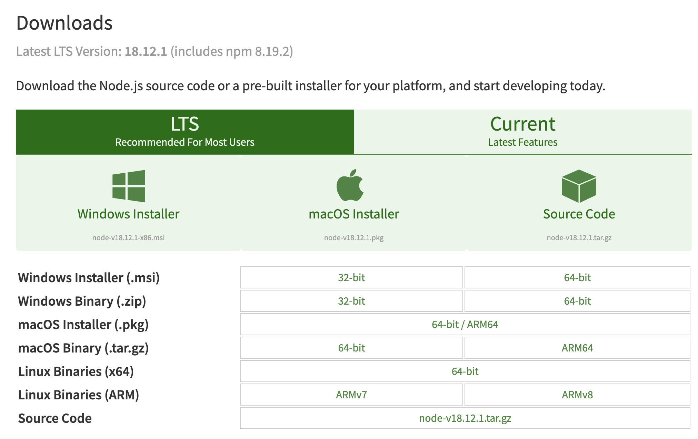
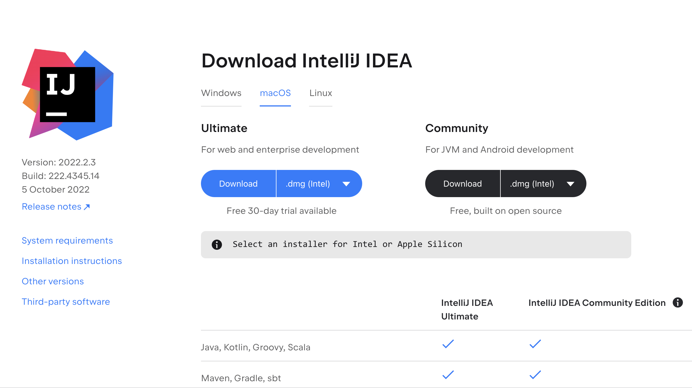
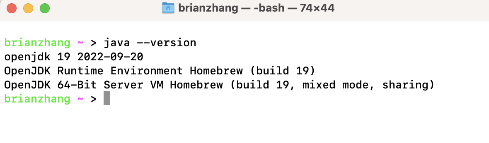
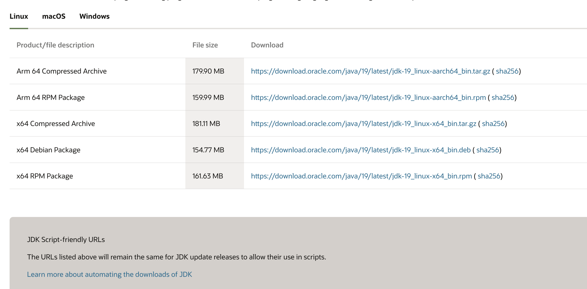
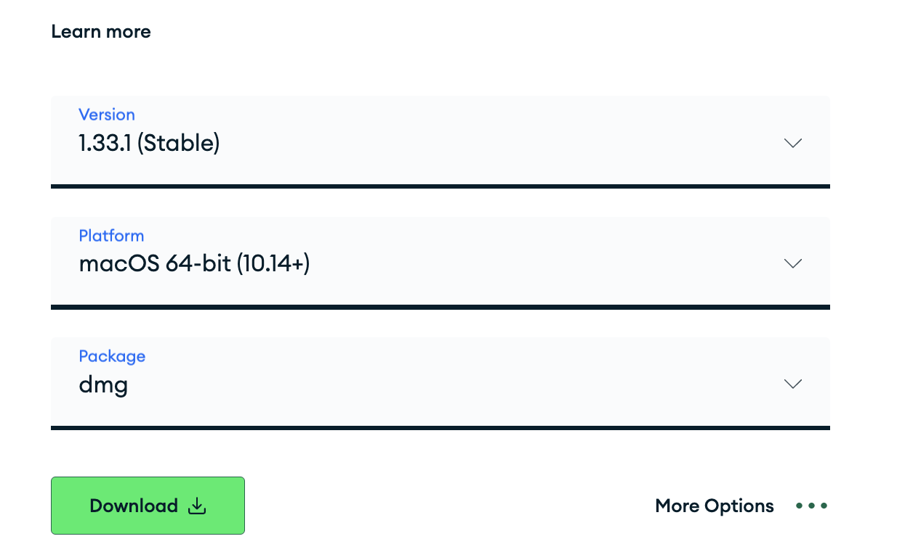
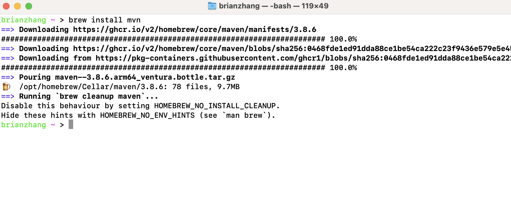
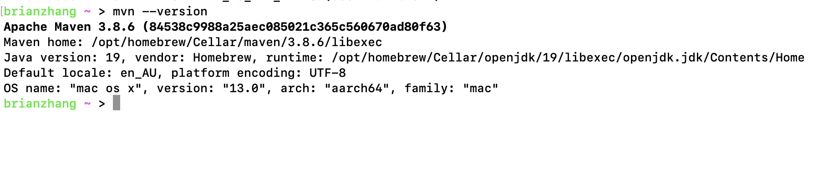
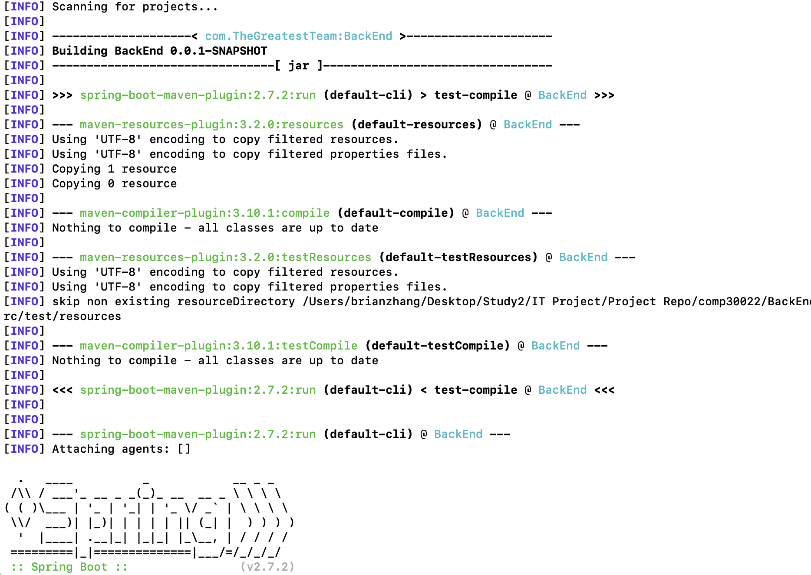
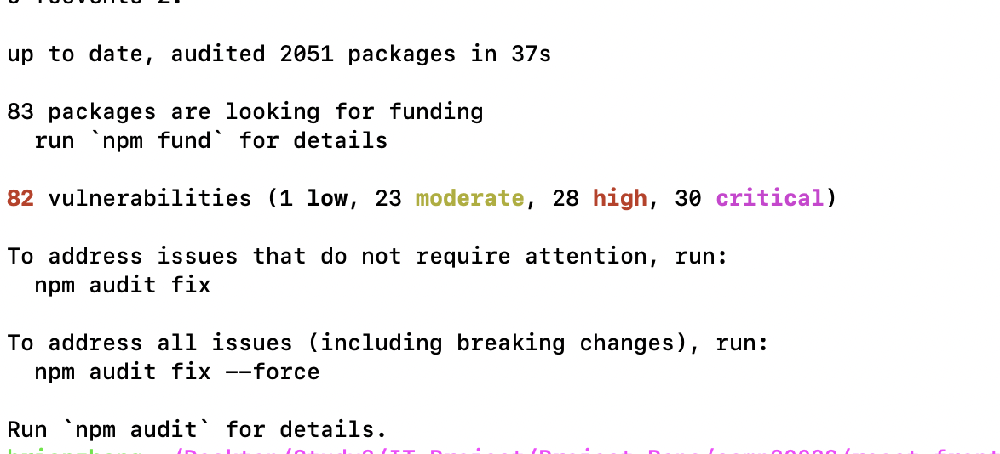

# [Fidelma](https://github.com/The-Greatest-Team/comp30022)

App Link: https://fidelma-reactjs.herokuapp.com/


## **Introduction**

This application is a restaurant management system built for the restaurant Fidela. It includes a variety of functionalities for both customers and staff end. 
For example, customers can place orders. Staff can manage dishes and ingredients.
For more, visit (https://zizhzhang.atlassian.net/wiki/spaces/THE/pages/2785472/Requirements) for all user stories.

The backend server uses Spring Boot framework and provides restful API service that the React frontend uses. The database used is MongoDB. The project is deployed to two Heroku apps


## **Check List**
- [x] Requirement
- [x] How to start the app
- [x] Environment Variables
- [x] Documentation
- [x] Future Improvement

## **Requirements**

1. Download **node.js** and npm from https://nodejs.org/en/download.
2. Download **IntelliJ IDEA** from https://www.jetbrains.com/idea/download.
3. Update **JDK** to version 17 or later.
4. Has a valid **Gmail** and **MongoDB account**.
5. Download Database Visualisation Tool **Mongodb Compass** from https://www.mongodb.com/try/download/compass


## **Installation Instruction**

### Install Node.js (Choose one of the option below)
1. Homebrew (Require MacOS, as well as homebrew installed)
    ```brew install node```
2. General package installation (Choose the right version for your OS)
    


### Install Intellij IDEA
1. Head to https://www.jetbrains.com/idea/download
    


### Install JDK on your OS
1. Homebrew (Require MacOS and Homebrew installed)

    ```brew install java```

    after which you can test by prompting:
    
   ```java --version```
    
    if installation is successful it would show
    
    
2. Official Download (Orecle JDK: https://www.oracle.com/au/java/technologies/downloads/)
    

    And then follow along with the installation process when prompted

### Download Mongodb Compass for Database Visualisation
- Head to https://www.mongodb.com/try/download/compass and choose for the compatible OS


### Start up Mongodb 
- See link: https://www.mongodb.com/basics/create-database
- Sign up: https://www.mongodb.com/cloud/atlas/register

### Download Maven 
1. Homebrew (Require MacOS and Homebrew installed)

    ```brew install mvn```
    

    Then check if you successfully installed it
    
    ```mvn --version```
    
    
2. General installation process
- most modern IDEs will have the build-in installation option for Maven, Intellij IDEA, Eclipse, NetBeans
- if there is no option for that, you can visit the Apache Maven download website https://maven.apache.org/download.cgi


## **Start the Localhost Application**

The Localhost server and application is located at **DevelopmentFinalise** branch, the **Main** Branch is used for remote deployment and remote hosting version only.

#### In order to start the localhost application using command line:
1. Start the BackEnd server running:
   - Open up Command line tool such as _Terminal_ or _Iterm_
   - navigate to the backend project folder: 
      **comp30022/BackEnd**
   - make sure you have Apache Maven installed and run command: 
    
     ```mvn spring-boot:run```
   - First time initialisation will do package import and installation of some package dependencies
   - If the build is successful you will see:
     
   
2. Start the front end application:
    - Open up Command line tool such as _Terminal_ or _Iterm_
    - navigate to the frontend project folder, make sure the ```package.json``` is within the folder:
      **comp30022/react-fronted**
    - make sure you have node installed and run the command:
   
      ```npm install```
      
    - The first time install will install all necessary packages and libraries, it can take some time, after successfully installed it will show:
      
    
    - Then we will run ```npm start``` to start the application
    
1) open the whole project with IntelliJ IDEA, go to BackEnd/src/main/java/com/thegreatestteam/backend/BackEndApplication to run the main function, if SpringApplication is unrecognised, check "BackEnd Maven instruction" below to recognised it.
2) open the react-frontend file with Vscode(other tools with terminal also fine), if it's first time run, run 'npm install' to install all the dependency first(if see few warning with word 'deprecated', it's fine to continue, this is because the version we choosed is bit old, we considering to change to a newer version in next few sprint, but for now, all the function works fine with this a bit old version), then run 'npm start run' to run the project, the web app is using localhost:3000, the route of each page is define in the App.js.

### BackEnd Maven instruction 

If SpringApplication is unrecognised, navigate to the backend folder and rightclick "pom.xml", 
select "add as Maven Project". Then right click again the pom.xml and select Maven --> Reload Project


## Environment Variables:
- Frontend:
  ```
  frontend.host.local=http://localhost:3000
  frontend.host.heroku=https://fidelma-reactjs.herokuapp.com
  frontend.host.heroku2=http://fidelma-reactjs.herokuapp.com
  ```
- Backend:
  ```
  spring.data.mongodb.uri=mongodb+srv://app:<password>@cluster0.9kzpmzz.mongodb.net/<<Database name>>?retryWrites=true&w=majority
  spring.servlet.multipart.max-file-size=2MB
  spring.servlet.multipart.max-request-size=2MB
  spring.servlet.multipart.enabled=true
  
  ```

- Mongo DB Account
   ```
   Username: thegreatestteam
   password: VzI1YYho9OUMlj6R
   ```

## Documents:
- Jira: https://zizhzhang.atlassian.net/jira/software/projects/TEAM/boards/1
- Confluence: https://zizhzhang.atlassian.net/wiki/spaces/THE/pages/65538/This+is+the+Confluence+space+for+Team029+----+THE+GREATEST+TEAM

## Future Improvement:
- staff side can modify the profile

- responsive design, make sure the website works well on mobile, desktop and tablet

- add more animations make the loading smoother

- add register function for staff to create account

- add functionality that staff can make few dish into discount mode

- improve home page

- make the main menu is dynamic on the type

- Add alert system(maybe with voice) on the staff side when new order been send to staff side


